Лабораторная работа №1. Основы работы с Docker

University: ITMO University
Faculty: FICT
Course: Введение в веб-технологии
Year: 2025/2026
Group: U4225
Author: Angelina Diachkova
Lab: Lab1
Date of create: 08.09.2026
Date of finished: —

Цель работы

Изучить основные возможности Docker: работу с образами и контейнерами, запуск веб-сервера, управление контейнерами и использование Docker Volumes.

Ход работы

Шаг 1. Установка Docker Desktop

Для выполнения лабораторной работы был установлен Docker Desktop для Windows.

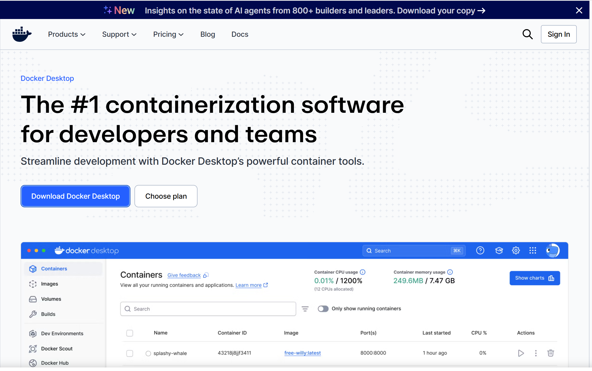

Шаг 2. Проверка версии Docker

Выполнена команда:

```powershell
docker --version
```

Команда использовалась для проверки установленной версии Docker.

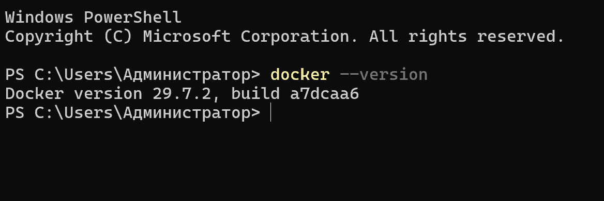

Шаг 3. Запуск тестового контейнера


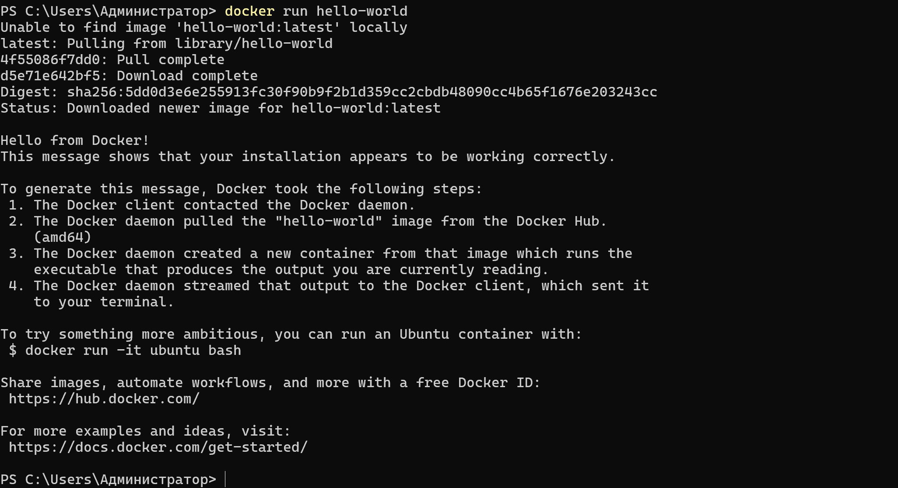

Шаг 4. Просмотр образов и контейнеров


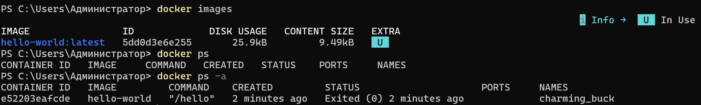

Шаг 5. Загрузка образа Ubuntu

Образ Ubuntu был загружен из Docker Hub

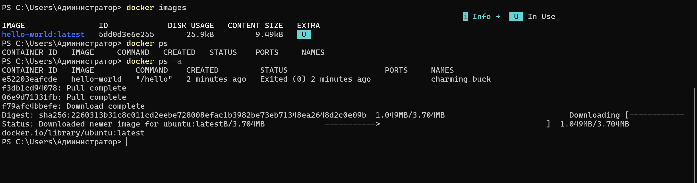

Шаг 6. Запуск контейнера Ubuntu

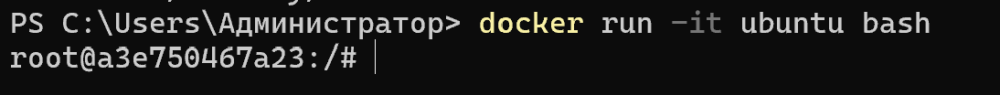

Шаг 7. Обновление списка пакетов


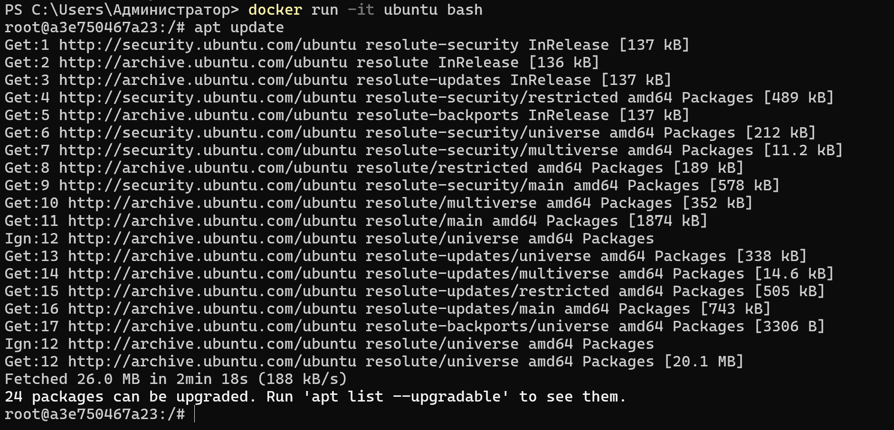

Шаг 8. Установка curl


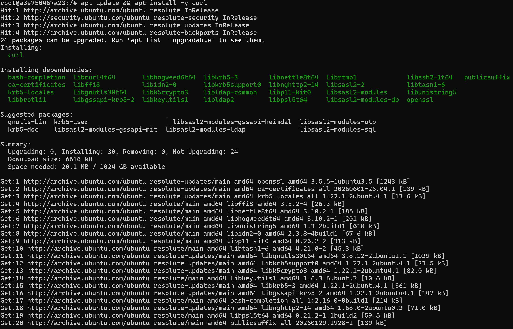

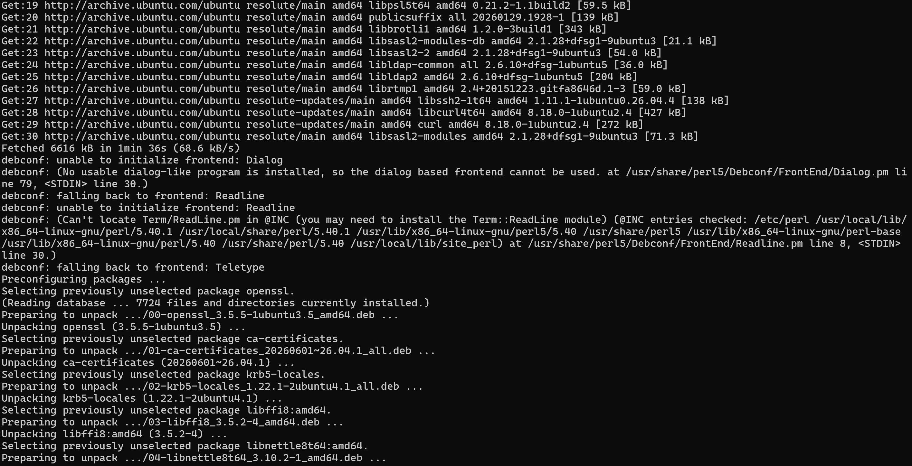

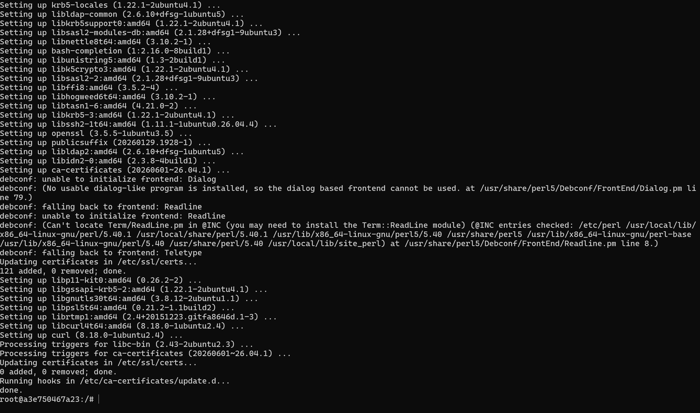

Шаг 9. Проверка установки curl

После проверки выполнен выход из контейнера


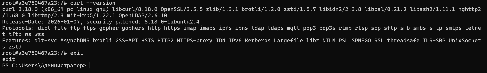

Шаг 10. Запуск веб-сервера nginx


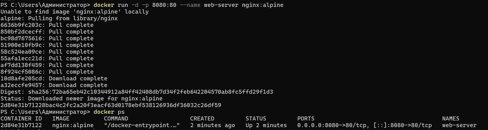

Шаг 11. Проверка работы nginx

В браузере открыт адрес:


Появилась стандартная страница Welcome to nginx!
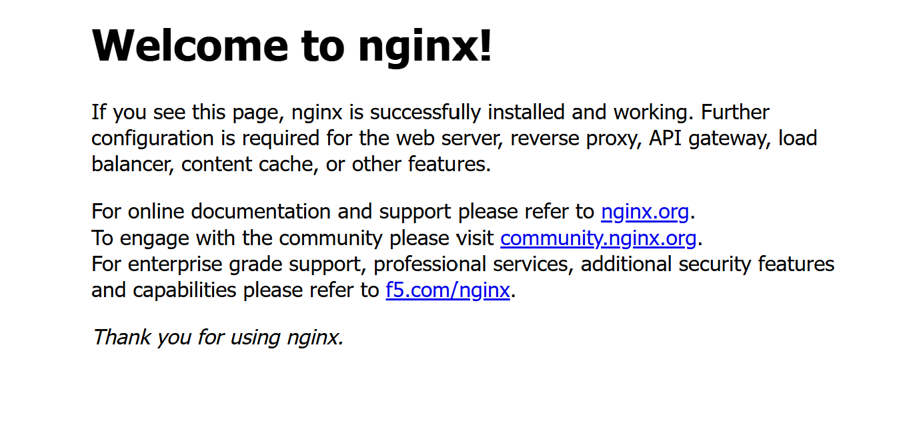

Шаг 12. Просмотр логов nginx


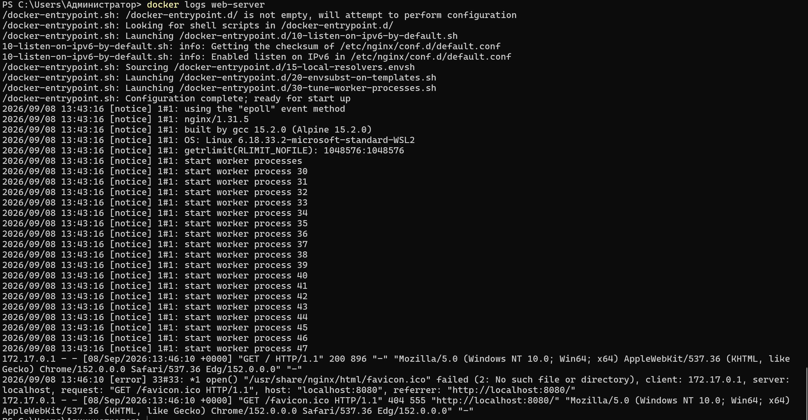

Шаг 13. Подключение к контейнеру nginx


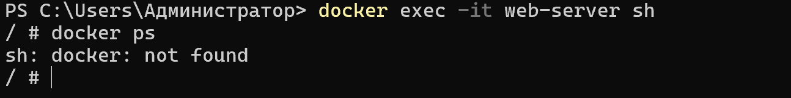

Шаг 14. Управление контейнерами


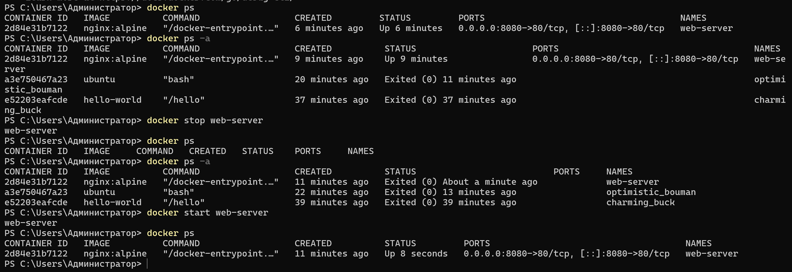

Шаг 15. Удаление контейнера и образа nginx


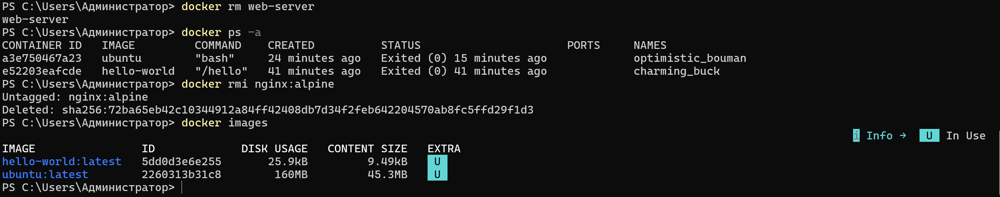

Шаг 16. Создание Docker Volume


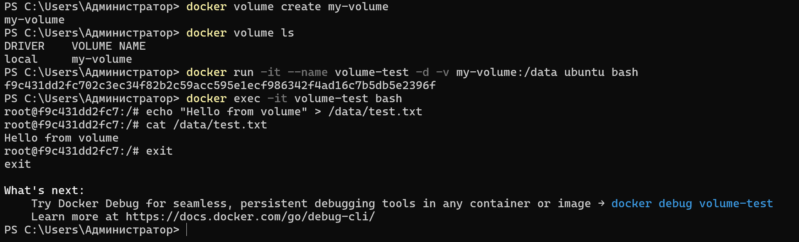

Шаг 17. Проверка сохранения данных в Docker Volume

Первый контейнер был остановлен и удалён
Создан новый контейнер с тем же Volume

Файл сохранился после удаления первого контейнера

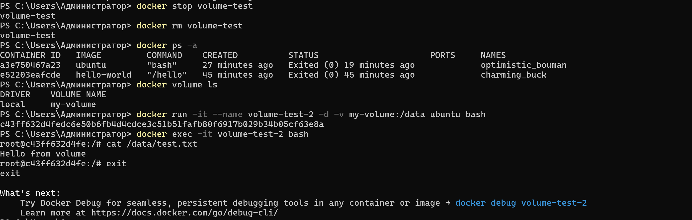

Шаг 18. Проверка контейнеров в Docker Desktop

Созданные контейнеры были проверены через графический интерфейс Docker Desktop.

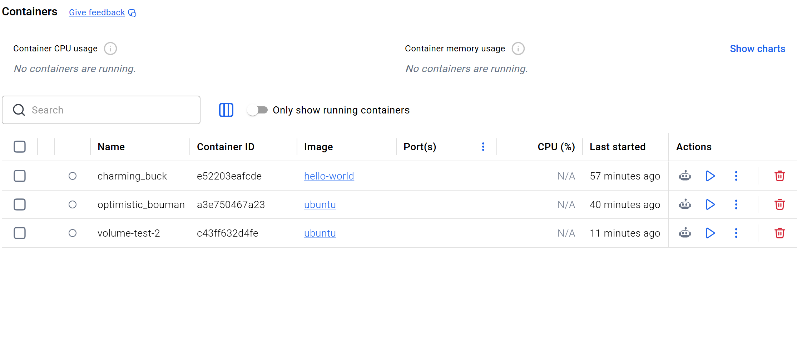

Вывод

В ходе лабораторной работы были изучены основные команды Docker, работа с образами и контейнерами, запуск веб-сервера nginx, управление контейнерами и использование Docker Volumes для сохранения данных.