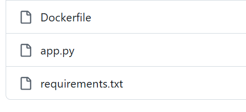
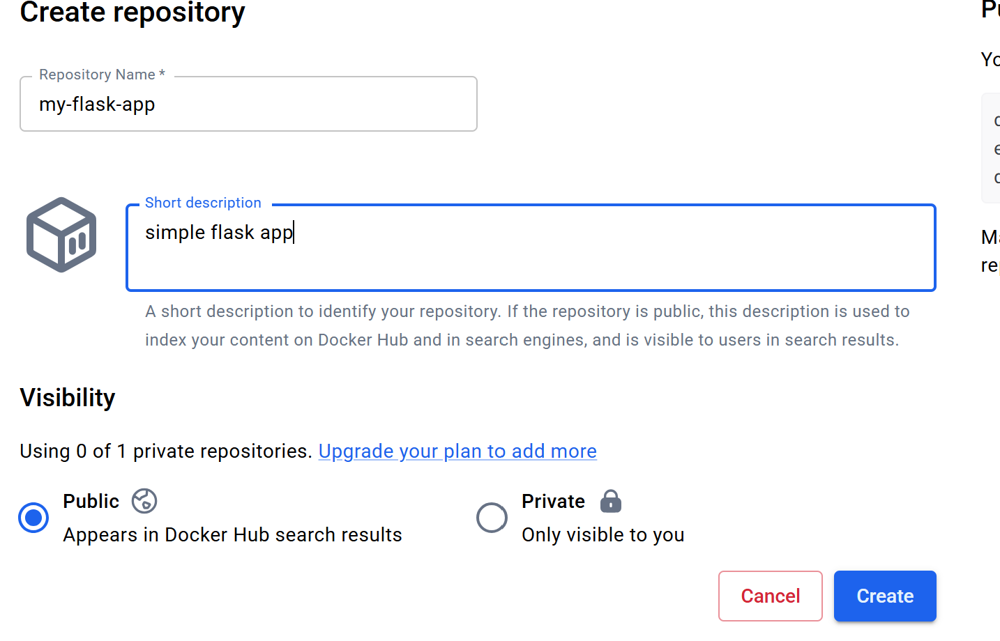
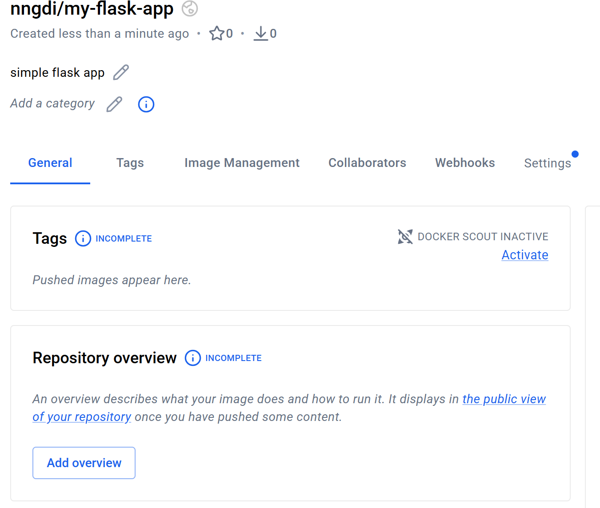
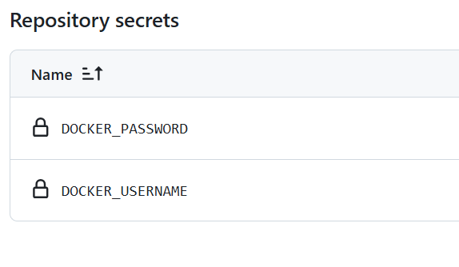
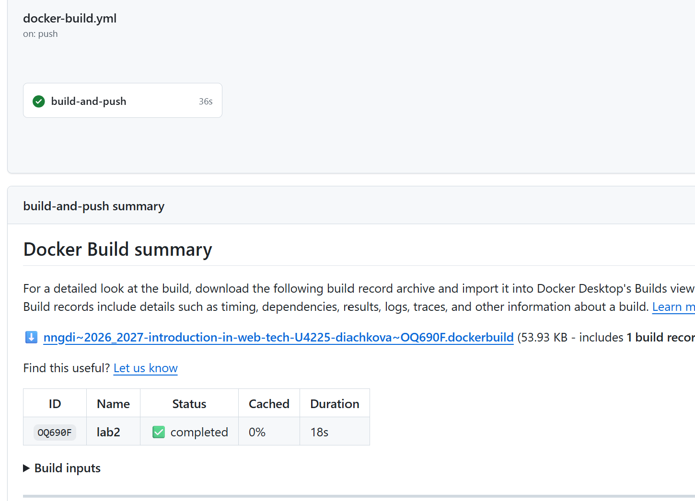
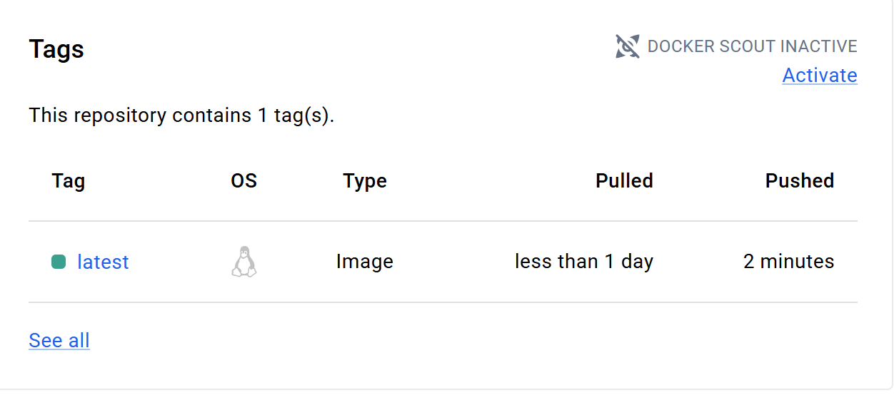

Лабораторная работа №2

Настройка CI/CD пайплайна с GitHub Actions

1. Подготовка проекта

Для выполнения лабораторной работы были созданы необходимые файлы приложения:

- `app.py` — Flask-приложение;
- `requirements.txt` — список необходимых зависимостей;
- `Dockerfile` — инструкция для сборки Docker-образа.

2. Создание репозитория в Docker Hub

В Docker Hub был создан публичный репозиторий `my-flask-app` для хранения Docker-образа приложения.

После создания репозиторий появился в Docker Hub.

3. Настройка GitHub Actions

В корне GitHub-репозитория была создана папка:

`.github/workflows/`

В ней был создан файл `docker-build.yml`.

В файле `docker-build.yml` был настроен CI/CD-пайплайн, который:

- запускается при `push` в ветку `main`;
- использует Ubuntu в качестве runner;
- получает файлы проекта из GitHub-репозитория;
- настраивает Docker Buildx;
- выполняет авторизацию в Docker Hub;
- собирает Docker-образ;
- публикует Docker-образ в Docker Hub с тегом `latest`;
- выполняет шаг деплоя с помощью команды `echo`.

4. Настройка доступа к Docker Hub

Для безопасной авторизации GitHub Actions в Docker Hub был создан Personal Access Token с правами `Read & Write`.

Полученный токен используется вместо обычного пароля от аккаунта Docker Hub.

5. Настройка GitHub Secrets

В настройках GitHub-репозитория были созданы два секрета:

- `DOCKER_USERNAME` — имя пользователя Docker Hub;
- `DOCKER_PASSWORD` — Personal Access Token Docker Hub.

Использование Secrets позволяет не хранить данные для авторизации непосредственно в файле пайплайна.

6. Запуск CI/CD пайплайна

После сохранения изменений в ветке `main` GitHub Actions автоматически запустил созданный workflow.

Пайплайн `build-and-push` был успешно выполнен.

В результате выполнения пайплайна Docker-образ был автоматически собран и опубликован в Docker Hub.

7. Проверка результата в Docker Hub

После успешного выполнения GitHub Actions в репозитории `my-flask-app` появился Docker-образ с тегом `latest`.

Вывод

В ходе лабораторной работы был настроен CI/CD-пайплайн с использованием GitHub Actions.

При отправке изменений в ветку `main` автоматически выполняются получение файлов проекта, настройка Docker Buildx, авторизация в Docker Hub, сборка Docker-образа, его публикация в Docker Hub и выполнение шага деплоя.

Для безопасного хранения данных авторизации были использованы GitHub Secrets. В результате Docker-образ приложения был успешно опубликован в Docker Hub с тегом `latest`.
