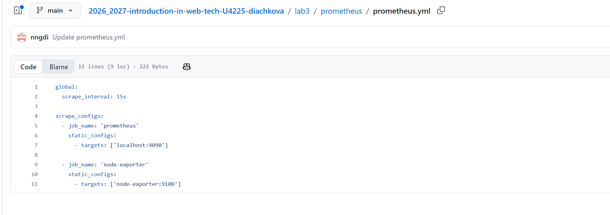
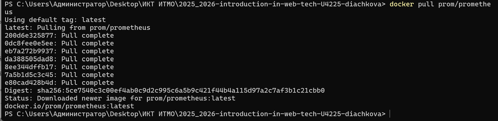
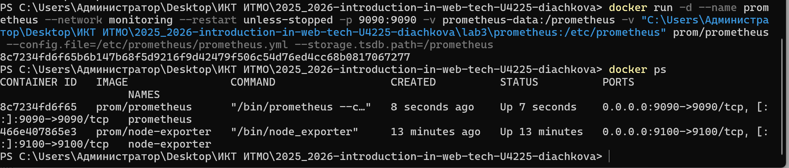
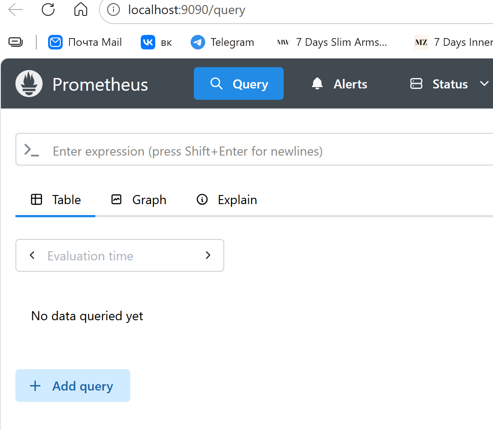
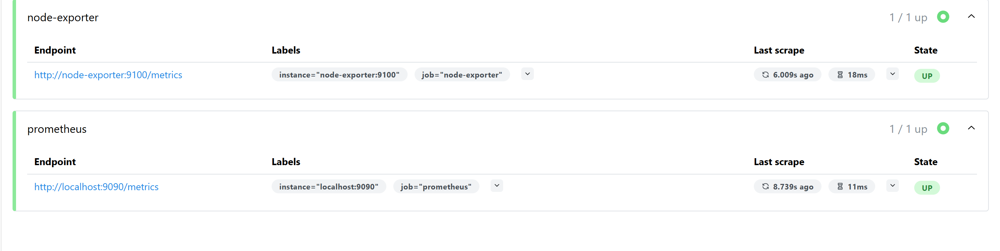
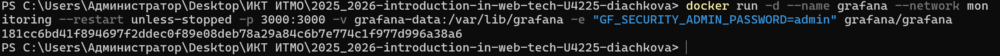
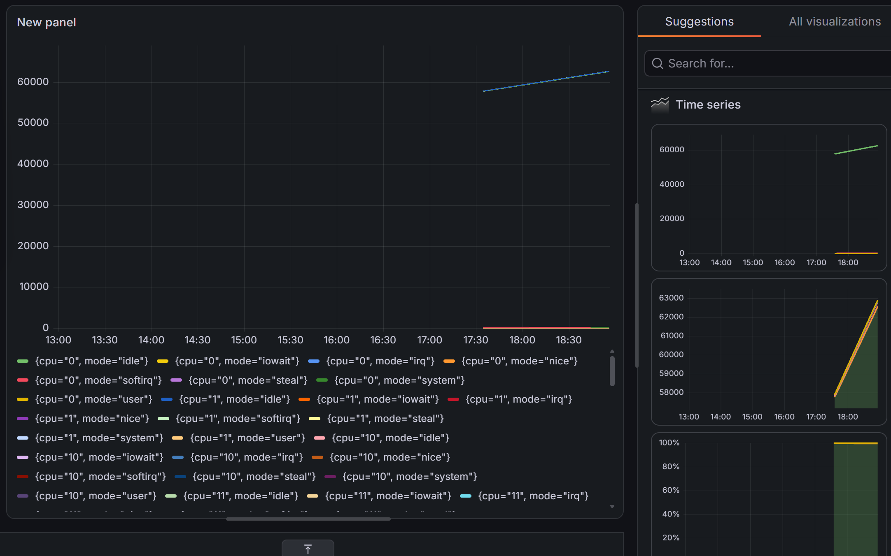
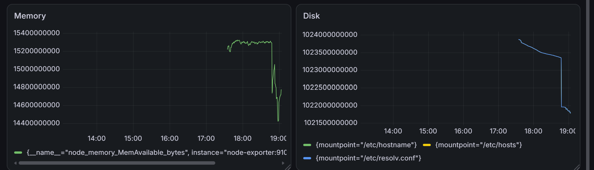

Лабораторная работа №3

Мониторинг с Prometheus и Grafana

1. Создание конфигурации Prometheus

Для настройки Prometheus была создана папка `prometheus` и файл `prometheus.yml`.

В конфигурации был установлен интервал сбора метрик 15 секунд и добавлены два источника:

- Prometheus на порту 9090;
- Node Exporter на порту 9100.

2. Подготовка Docker

Для хранения данных были созданы Docker volumes:

- `prometheus-data`;
- `grafana-data`.

Также была создана общая Docker-сеть `monitoring`, необходимая для взаимодействия контейнеров Prometheus, Grafana и Node Exporter.

3. Запуск Node Exporter

Был запущен контейнер Node Exporter для сбора системных метрик.

Node Exporter предоставляет информацию о процессоре, оперативной памяти, файловой системе и других параметрах системы через порт 9100.

Работа Node Exporter была проверена по адресу:

`http://localhost:9100/metrics`

На странице успешно отображались системные метрики.

4. Запуск Prometheus

Был загружен Docker-образ Prometheus.

После этого был запущен контейнер Prometheus с подключением к сети `monitoring`, volume `prometheus-data` и файлу конфигурации `prometheus.yml`.

После запуска было проверено состояние контейнеров.

Работа Prometheus была проверена в браузере по адресу:

`http://localhost:9090`

В разделе Target health было проверено состояние источников метрик.

Prometheus и Node Exporter имеют состояние `UP`, что подтверждает успешный сбор метрик.

5. Запуск Grafana

Был запущен контейнер Grafana с подключением к сети `monitoring` и volume `grafana-data`.

Grafana работает на порту 3000.

После запуска был открыт веб-интерфейс Grafana по адресу:

`http://localhost:3000`

Для входа использовались стандартные данные администратора.

6. Подключение Prometheus к Grafana

В Grafana был добавлен новый источник данных Prometheus.

Для подключения использовался адрес:

`http://prometheus:9090`

После выполнения Save & Test соединение было успешно установлено.

7. Создание Dashboard

В Grafana был создан новый Dashboard.

В качестве источника данных был выбран Prometheus.

Для первого графика была использована метрика:

`node_cpu_seconds_total`

Метрика позволяет получать информацию о работе процессора.

8. Создание дополнительных графиков

Для мониторинга различных характеристик системы были добавлены дополнительные графики.

Для оперативной памяти использовалась метрика:

`node_memory_MemAvailable_bytes`

Для дискового пространства использовалась метрика:

`node_filesystem_avail_bytes`

В результате Dashboard содержит графики для мониторинга:

- CPU;
- оперативной памяти;
- дискового пространства.

9. Тестирование системы

Была проверена работа всех компонентов системы мониторинга:

- Node Exporter собирает системные метрики;
- Prometheus получает и хранит метрики;
- Grafana получает данные из Prometheus и отображает их в виде графиков.

В Prometheus источники `prometheus` и `node-exporter` имеют состояние `UP`.

В Grafana успешно отображаются графики CPU, памяти и дискового пространства.

Вывод

В ходе лабораторной работы была настроена локальная система мониторинга с использованием Node Exporter, Prometheus и Grafana.

Node Exporter используется для сбора системных метрик, Prometheus — для их получения и хранения, а Grafana — для визуализации данных.

Была настроена связь между контейнерами через Docker-сеть `monitoring`, подключен Prometheus в качестве источника данных Grafana и создан Dashboard с графиками CPU, оперативной памяти и дискового пространства.

В результате система мониторинга успешно работает и позволяет отслеживать основные показатели системы.
